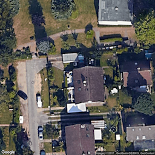
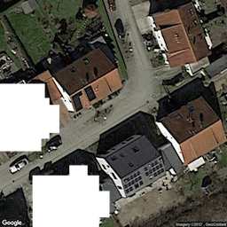
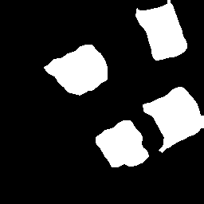

A small projectt in which I trained a deeplab model on a rather small dataset to locate roofs on satellite images.

#Examples

## 1.Train: 
sample image and true mask

  
  

## 2.Train:
sample test image and predicted output

  
  

